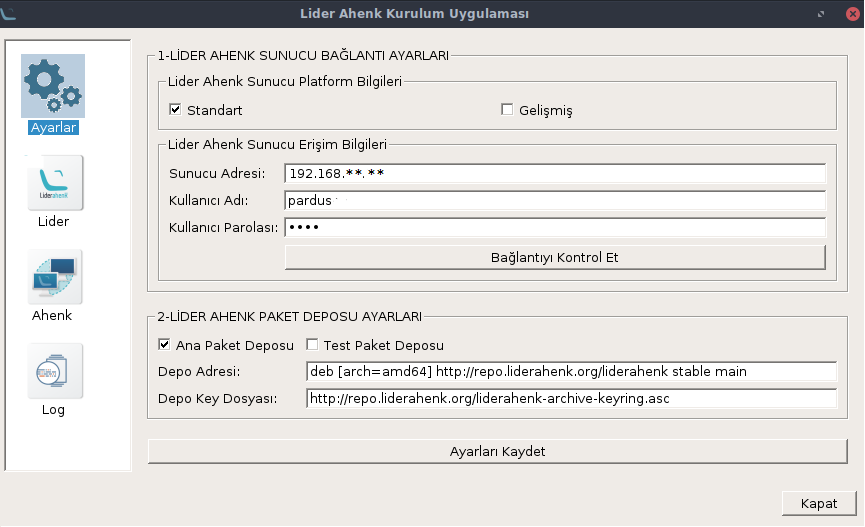
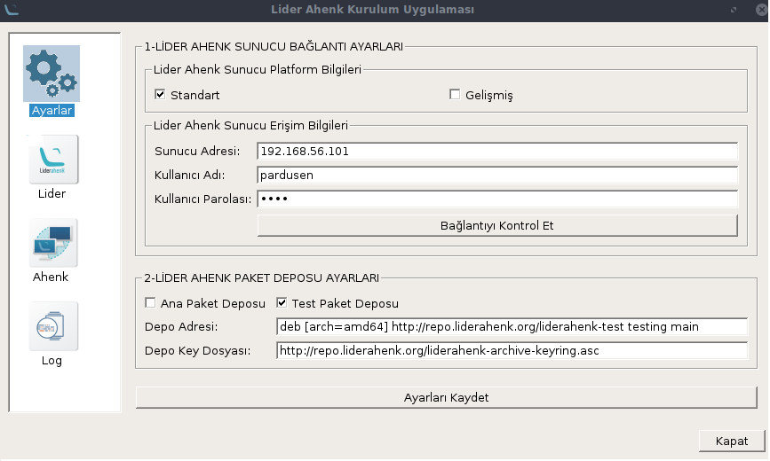
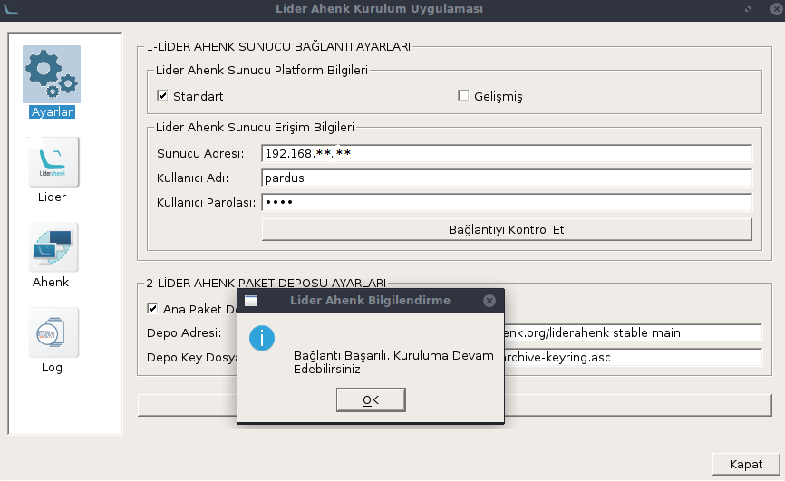
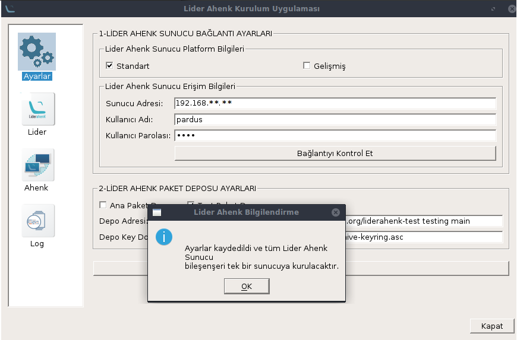
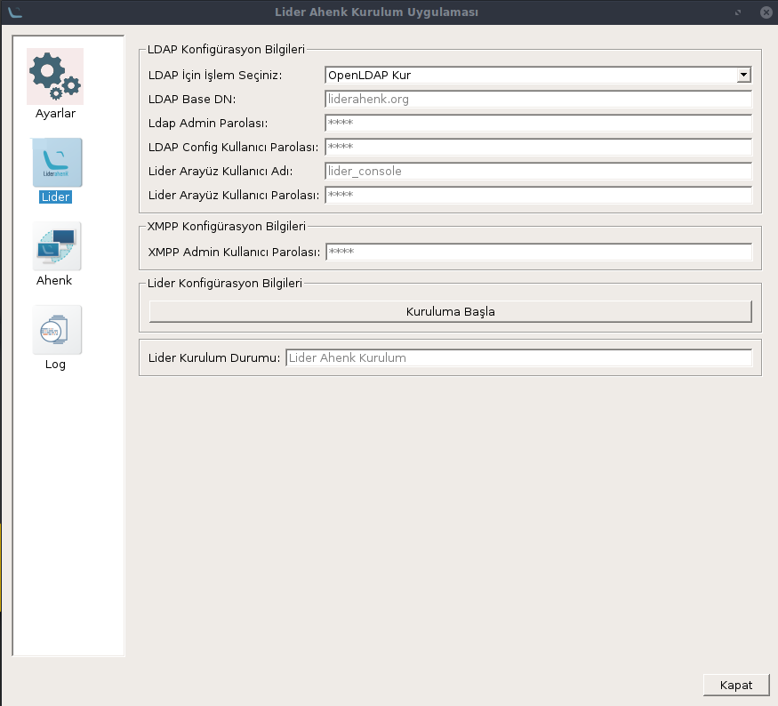
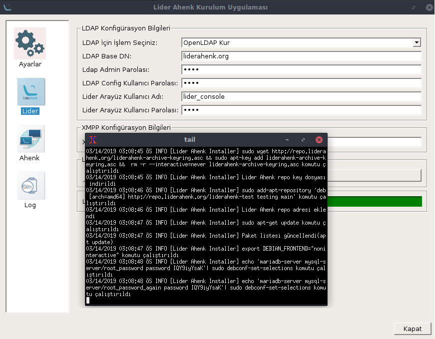
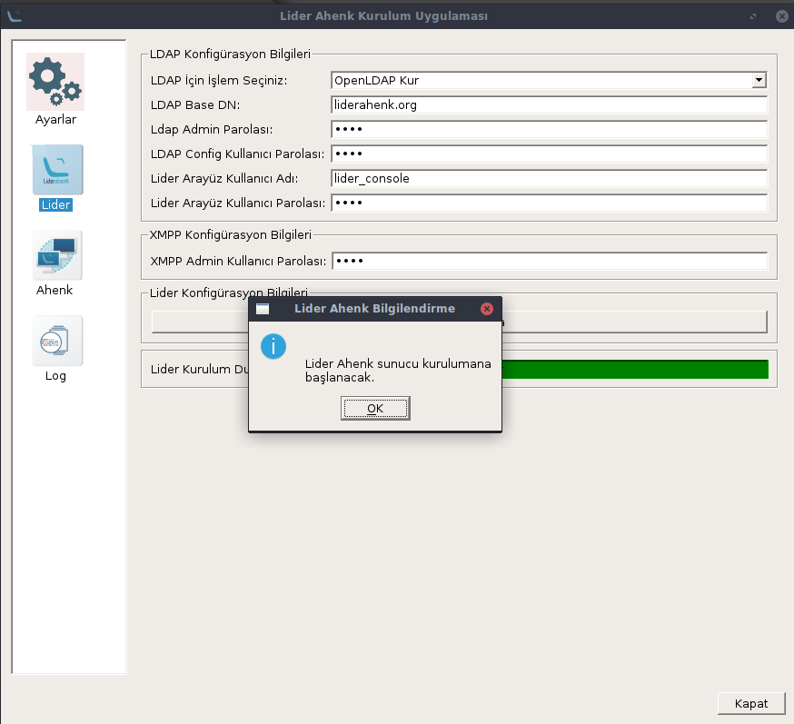
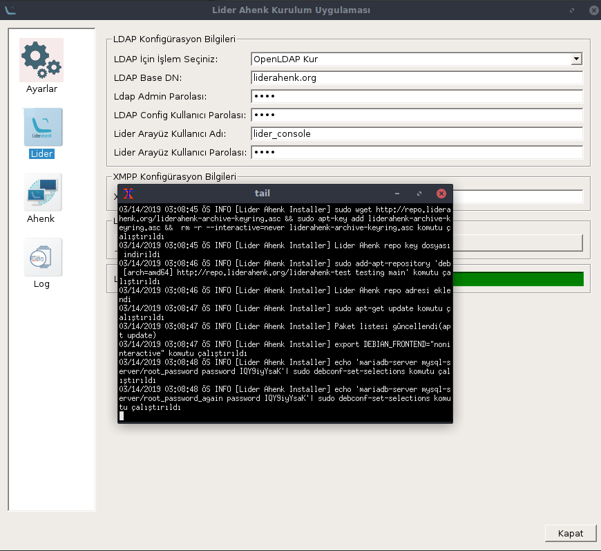

# LİDER AHENK UYGULAMASI NASIL KURULUR

## Bağımlılıkların Kurulması

Uçbirimde aşağıdaki komutları sırasıyla yazılır.

````
sudo apt-get install python3-yaml python3-paramiko python3-pyqt5
````

````
sudo apt-get install python3-pip
````

````
pip3 install ruamel.yaml
````

## Uygulamanın İndirilmesi

Lider Ahenk Kurulum Uygulamasını indirmek için,

````
sudo apt-get install git
````

önce github kütüphanesi indirip yüklenir

````
git clone https://github.com/Pardus-LiderAhenk/lider-ahenk-installer.git
````

Githubdan Lider Ahenk Kurulum Uygulaması kurulur.

## Uygulamanın Çalıştırılması

Kurulum ugulamasını çalıştırmak için;

````
cd /lider-ahenk-instaler/src/
````

komutu ile src dizinine gidilir ve

````
python3 app.py
````

komutu ile kurulum uygulaması çalıştırılır.

##### Not : Uygulamayı çalıştırmadan önce lider ahenk kurulum uygulamasının çalıştırıldığı makinede ve  kurulum yapılacak makinelerde ssh paketinin kurulu olmalıdır.

## Menüler

Uygulamamız solda görüldüğü gibi 4 menüden oluşur.

### 1. Ayarlar Menüsü

Ayarlar menüsünde Lider Ahenk Sunucu Bağlantı Ayarları ve Lider Ahenk Paket Deposu Ayarlarının yapıldığı menüdür.

Lider Ahenk Sunucu Bağlantı Ayarları,
Standart Kurulum ve Gelişmiş Kurulum olmak üzere iki şekilde gerçekleşir.

Standart Kurulum Lider Ahenk Bileşenlerini tek bir makineye kurmamızı sağlar. Standart Kurulum adımları için <a href = "#standart" >tıklayınız.</a>

Gelişmiş Kurulum Lider Ahenk Bileşenlerini ayrı makinelere kurmamızı sağlar. Gelişmiş Kurulum adımları için <a href = "#gelismis" >tıklayınız.</a>

##### Ana Paket Deposu : Geliştirilmelerin tamamlandığı stabil çalışan depordur.

##### Test Paket Deposu : Yeni geliştirmelerin yayınlandığı depodur.

<p id = "standart"></p>

#### 1.1. Standart Kurulum

Standart Kurulum Lider Ahenk Sunucu bileşenlerinin (Veritabanı, OpenLDAP, XMPP, Lider) tek bir makineye kurulmasını sağlar.

Standart Kurulum için, Lider Ahenk Sunucu Bağlantı Ayarlarındaki Standart kutucuğuna tıklanır.




Ayarlar menüsündeki Lider Ahenk Sunucu Bağlantı Ayarlarındaki Standart seçeneği seçilir. Kurulum yapılacak makinenin ip adresini sunucu adresine, sudo yetkili kullanıcı adını ve paralosını kullanıcı adı ve parola kısmına yazılır.





Bağlantıyı kontrol et butonuna tklayarak bağlantının başarılı olup olmadığından emin olunur. Daha sonra Lider Ahenk Paket Deposu Ayarları yapılır. Bunun için <a href = "#ayarlar" >tıklayınız. </a>

<p id = "gelismis"></p>

#### 1.2. Gelimis Kurulum

Gelişmiş kurulum Lider Ahenk Sunucu bileşenlerinin (Veritabanı, OpenLDAP, XMPP, Lider) ayrı makinelere kurulmasını sağlar.

Gelişmiş kurulum için, Lider Ahenk Sunucu Bağlantı Ayarlarındaki Gelişmiş kutucuğuna tıklanır.




Veritabanı, OpenLDAP, XMPP, Liderin yükleneceği makinelerin ip adresleri sudo yetkili kullanıcı adları ve paroları girlir ve ekle butonuna basılır. Daha sonra bağlantıyı kontrol et butonuna tıklayarak bağlantılardan başarılı olduğunda emin olunur. Daha sonra Lider Ahenk Paket Deposu Ayarları yapılır. Bunun için <a href = "#ayarlar" >tıklayınız. </a>

<p id = "ayarlar">
#### 1.3. Lider Ahenk Paket Deposu Ayarları

Lider Ahenk Paket Deposu Ayarları, Ana Paket Deposu ve Test Paket Deposu olmak üzere 2 seçenekten oluşur. 

Ana Paket Deposu geliştirmelerin tamamlandığı stabil çalışan, Test Paket Deposu yeni geliştirmelerin yayınlandğı depodur.



Kulanılmak istenilen paket deposu seçildikten sonra bağlantıyı kontrol et butonuna tıklayarak devam edilir. Lider Menüsüne geçilir.

##### Not : 

### 2. Lider Menüsü

Lider menüsü Lider Ahenk sunucu konfigürasyonlarının ve kurulumun başlatıldığı bölümdür.

##### Not : Burda LDAP seçeneğini eğer kurulucak sunucuda  OpenLDAP kuruluysa OpenLDAP Güncelle seçeneğini seçmeniz gerekir.
<br>


Ayarlar menüsünden sonra lider sekmesindeki alanları dolduruyoruz. LDAP seçeneğini kurulum yapılacak makinede kuruluysa Güncelle seçeneğini seçiyoruz kurulu değilse kur seçeği seçilir. Boş alanlar doldurulup,
kuruluma başlamak için kuruluma başla butonuna tıklanır.



Kurulum devam ediyor.



Kurulum bittiğinde bu bildirim alınır.

### 2. Log Menüsü

Log menüsüde ise kurulumda gerçekleşen komutları, bilgileri, hataların görüldüğü menüdür.



Log menüsünü açarak kurulumdaki varsa hataları görebiliriz.

