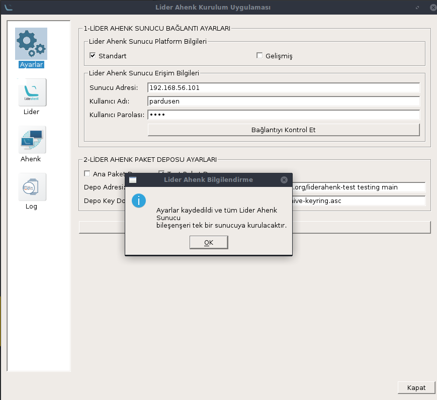

# LİDER AHENK UYGULAMASI NASIL KURULUR

## Bağımlılıkların Kurulması

Uçbirimde aşağıdaki komutları sırasıyla yazılır.

````
sudo apt-get install python3-yaml python3-paramiko python3-pyqt5
````

````
sudo apt-get install python3-pip
````

````
pip3 install ruamel.yaml
````

## Uygulamanın İndirilmesi

Lider Ahenk Kurulum Uygulamasını indirmek için,

````
sudo apt-get install git
````

önce github kütüphanesi indirip yüklenir

````
git clone https://github.com/Pardus-LiderAhenk/lider-ahenk-installer.git
````

Githubdan Lider Ahenk Kurulum Uygulaması kurulur.

## Uygulamanın Çalıştırılması

Kurulum ugulamasını çalıştırmak için;

````
cd /lider-ahenk-instaler/src/
````

komutu ile src dizinine gidilir ve

````
python3 app.py
````

komutu ile kurulum uygulaması çalıştırılır.

##### Not : Uygulamayı çalıştırmadan önce lider ahenk kurulum uygulamasının çalıştırıldığı makinede ve  kurulum yapılacak makinelerde ssh paketinin kurulu olmalıdır.

## Menüler

Uygulamamız solda görüldüğü gibi 4 menüden oluşur.

### 1. Ayarlar Nenüsü

Ayarlar menüsünde Lider Ahenk Sunucu Bağlantı Ayarları ve Lider Ahenk Paket Deposu Ayarlarının yapıldığı menüdür.

Lider Ahenk Sunucu Bağlantı Ayarları,
Standart Kurulum ve Gelişmiş Kurulum olmak üzere iki şekilde gerçekleşir.

Standart Kurulum Lider Ahenk Bileşenlerini tek bir makineye kurmamızı sağlar. Standart Kurulum adımları için <a href = "#standart" >tıklayınız.</a>

Gelişmiş Kurulum Lider Ahenk Bileşenlerini ayrı makinelere kurmamızı sağlar. Gelişmiş Kurulum adımları için <a href = "#gelismis" >tıklayınız.</a>

<p id = "standart">
#### 1.1. Standart Kurulum

Standart Kurulum Lider Ahenk Sunucu bileşenlerinin (Veritabanı, OpenLDAP, XMPP, Lider) tek bir makineye kurulmasını sağlar.

Standart Kurulum için, Lider Ahenk Sunucu Bağlantı Ayarlarındaki Standart kutucuğuna tıklanır.


<p id = "gelismis">
#### 1.2. Gelimis Kurulum
##### Ana Paket Deposu : Geliştirilmelerin tamamlandığı stabil çalışan depordur.

##### Test Paket Deposu : Yeni geliştirmelerin yüklendiği depodur.

#### Lider Sekmesi

Bu sekme sunucu konfigürasyonlarının ve kurulumun başlatıldığı bölümdür.
##### Not : Burda dikkat etmemiz gereken LDAP seçeneğini eğer kurulucak sunucuda  OpenLDAP kuruluysa OpenLDAP Güncelle seçeneğini seçmeniz gerekir.

#### Ahenk Sekmesi

Ahenk sekmesinde ahenk kullanıcıların eklendiği bölümdür.

#### Log Sekmesi

Log sekmesi ise hangi dosyların kurulduğunu ve hangi komutların kullanıldığını gösteren kurulumda herhangi bir hata olursa gösteren bölümdür.

### Kurulum

Kurulum standart ve gelişmiş olarak iki şekilde gerçekleşiyor.

### Standart Kurlum

Standar kurulum Veritabanı, OpenLDAP, Xmpp ve Lideri aynı makineye kurmamızı sağlar.


Ayarlar sekmesinde ki standart seçeneğini seçiyoruz.
Sunucu ip adresi
Kullanıcı adı,
Kullanıcı parolası yazan yerlere kurulum yapılacak makinenin ip adresi kullanıcı adı ve parololarını yazmalıyız. Burda yüklenicek makinedeki sudo da yetkili kullanıcı olmasına dikkat ediyoruz.

### Gelişmiş Kurulum

Lider ahenk uygulamasının tüm bileşenlerinin farklı makinelere kurmamızı sağlar.


Ayarlar sekmesindeki gelimiş seçeneğini seçiyoruz.
Ekle butonu ile tek tek Veritabanı, OpenLDAP, XMPP, Liderin kurulacağı makinelerin ip adreslerini, sudo yetkili kullanıcı adlarını ve şifrelerini giriyoruz.


Bağlantıyı kontrol et butonuna tıkladıktan sonra bilgilendirme kutusunda onay alıyoruz eğer bir hata verirse ip adresine ve iki makinede de ssh paketitinin kurulu olduğundan emin olunuz.


Ana paket Deposunu seçiyoruz, (Yeni gelişmeleri takip etmek istiyorsanız test paket deposunu da seçebilirsiniz).
Ayarları kaydet butonuna basıp seçtiğimiz paketi onaylıyoruz.



Ayarlar sekmesinden sonra lider sekmesindeki alanları dolduruyoruz. LDAP seçeneğini makinede kuruluysa Güncelle seçeneğini seçiyoruz kurulu değilse kur seçeğini seçerek devam ediyoruz.


Anlatılan işlemleri yaptıktan sonra kuruluma başlamak için kuruluma başla butonuna tıklıyoruz.


Kurulum devam ediyor.


Kurulum bittiğinde bu bildirimi alırsınız.


Log sekmesine gelerek uygulamanın hangi kurulumları yaptığını bir hata olup olmadığını hangi komutları kullandığını kurulum sonrasında görebilirsiniz.
