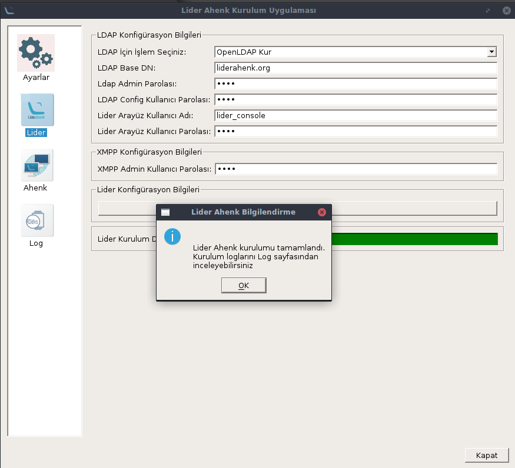
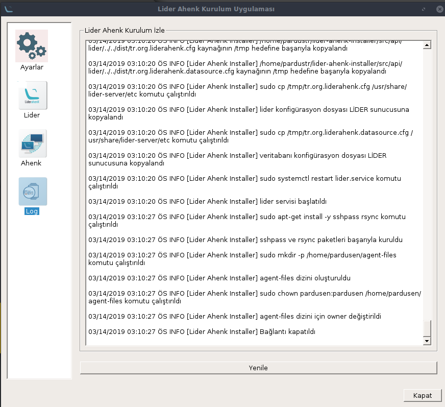

# LİDER UYGULAMASI NASIL KURULUR

## Bağımlılıkların Kurulması
````
sudo apt-get install python3-yaml python3-paramiko python3-pyqt5
````

````
sudo apt-get install python3-pip
````
````
pip3 install ruamel.yaml
````
## Uygulamanın İndirilmesi
````
sudo apt-get install git
````
````
git clone https://github.com/Pardus-LiderAhenk/lider-ahenk-installer.git
````
## Uygulamanın Çalıştırılması

Üstteki komutları yazdıktan sonra
kurulum uygulmasını çalıştırmak için dosya dizinine gidilir.

````
cd /lider-ahenk-instaler/src/
````
kurulum uygulmasını çalıştırmak önce için dosya dizinine gidilir.
````
python3 app.py
````
ile kurulum dosyası çalıştırılır.

Not : Uygulamayı çalıştırmadan önce kurulum yapılacak makinelerde ssh paketinin kurulu olduğundundan emin olunuz.

Uygulamamız solda görüldüğü gibi 4 sekmeden oluşur.

#### Ayarlar Sekmesi

Ayarlar sekmesi Standart ve Gelişmiş kurulumlardan hangisini seçiceğimizi belirlediğimiz kurulum yapılacak makinelerin bağlanmasını ve kontrolünü sağladığımız sekmedir. Ayrıca Lider Ahenk Paket Deposunu seçitiğimiz bölümdür.

###### Ana Paket Deposu : Geliştirilmelerin tamamlandığı stabil çalışan depordur.

###### Test Paket Deposu : Yeni geliştirmelerin yüklendiği depodur.

#### Lider Sekmesi

Bu sekme sunucu konfigürasyonlarının ve kurulumun başlatıldığı bölümdür.
Burda dikkat etmemiz gereken LDAP seçeneğini eğer kurulucak sunucuda OpenLDAP kuruluysa OpenLDAP Güncelle seçeneğini seçmeniz gerekir.

#### Ahenk Sekmesi

Ahenk sekmesinde ahenk kullanıcıların eklendiği bölümdür.

#### Log Sekmesi

Log sekmesi ise hangi dosyların kurulduğunu gösteren kurulumda herhangi bir hata olursa gösteren bölümdür.

Lider Ahenk Uygulamasının Standat ve Gelişmiş olmak üzere 2 kurulum şekli vardır.


Lider Ahenk Kurulum uygulaması açılır,


Burada
Sunucu Adresi
Kullanıcı Adı,
Kullanıcı Parolası yazan yerlere kurulum yapılacak makinenin ip adresi kullanıcı adı ve parololarını yazmalıyız,


Bağlantıyı kontrol et butonuna bastıktan sonra


Ana paket Deposunu seçiyoruz, (Yeni gelişmeleri takip etmek istiyorsanız test paket deposunu da seçebilirsiniz)


Ayarları kaydet butonuna tıkladıktan sonra,


Sol panelde yer alan lidere tıklayıp açılan sekmede,


Yukarda görüldüğü gibi alanları doldurunuz.


Kuruluma başla butonuna basarak kurulumu başlatabilirsiniz.




Kuruumun bittiğini bu bildirimlere alırsınız ve



Bu ekrandan hangi kurulumların yapıldğını kurulum sonunda görebilirsiniz.
